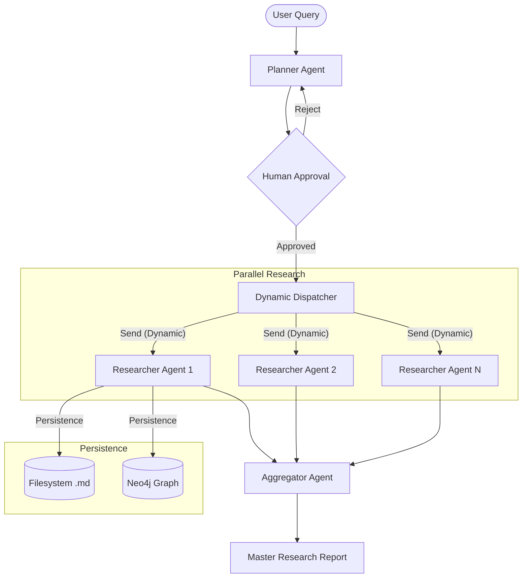

# MARGRe — Multi-Agent Relation Graph Researcher

A CLI-based multi-agent AI research tool designed to build detailed relational historical graphs. It uses **LangGraph** for orchestration and **Neo4j** for graph persistence.

---

## 🏗 High-Level Design



---

## 🚀 Getting Started

### 1. Prerequisites
- **Python 3.12+** (managed with `uv`)
- **Docker** (for Neo4j)
- **Local LLM** (OpenAI-compatible endpoint like LM Studio or OpenRouter)

### 2. Initial Setup
```bash
uv sync                      # Install dependencies
./docker_neo4j.sh            # Start Neo4j container
uv run margre init           # Create config.toml and apply graph constraints
```

### 3. Usage
Edit `config.toml` to point to your LLM provider. Then run:

#### Full Research Run
The main entry point. It creates a plan, asks for your approval, and then spawns agents in parallel. Use `--verbose` to see detailed agent logs.
```bash
uv run margre research "The Medicis of Florence and the Italian Renaissance" --verbose
```

#### Individual Utilities
```bash
uv run margre search "Machiavelli"         # Direct test of the web search provider
uv run margre chat "Hello World"             # Direct test of the LLM connection
```

---

## 📂 Project Structure
- `src/margre/workflow/`: LangGraph orchestrator, nodes (Planner, Researcher, Aggregator), and state definitions.
- `src/margre/llm/`: OpenAILike client wrappers and centralized prompt management.
- `src/margre/graph/`: Neo4j connection management and persistent repository.
- `src/margre/persistence/`: Filesystem management for Markdown/JSON results.
- `runs/`: Output for all research tasks.

---

## 🛠 Features (Phase 2 & 3 Completed)
- **Multi-Agent Orchestration**: Dynamic task decomposition and parallel execution via LangGraph.
- **Human-in-the-Loop**: Plan review and approval before resource execution.
- **Pluggable Search**: Built-in support for DuckDuckGo and SearXNG.
- **Dual Persistence**: Detailed Markdown reports on disk + structured historical entities in Neo4j (Source, Person, Event).
- **Consolidated Reporting**: Automatic synthesis of individual sub-reports into a cohesive master summary (Phase 4 anticipation).
