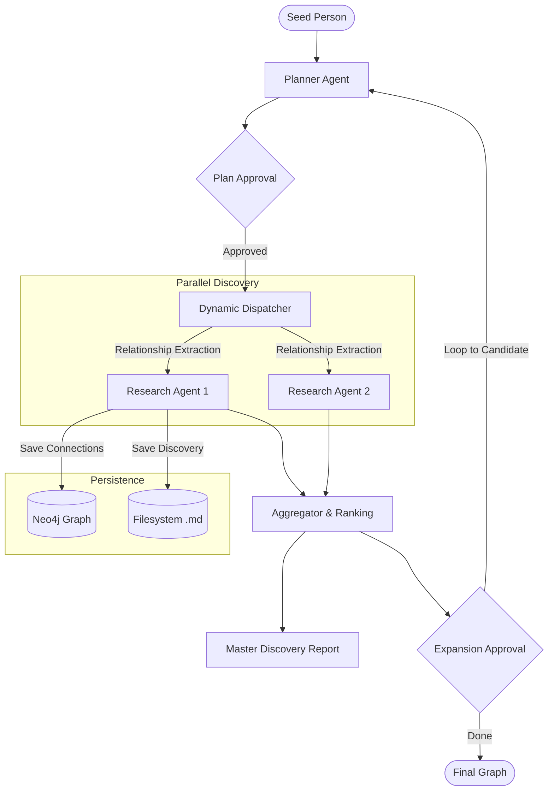

# MARGRe — Multi-Agent Relationship Discovery Engine

A CLI-based multi-agent AI tool designed to discover and map complex historical and contemporary networks. Starting from a single individual, it uses **LangGraph** to recursively hunt for connections (collaborators, rivals, mentors, institutions) and persists them into a **Neo4j** graph.

---

## 🏗 High-Level Design



---

## 🚀 Getting Started

### 1. Prerequisites
- **Python 3.12+** (managed with `uv`)
- **Docker** (for Neo4j)
- **Local LLM** (OpenAI-compatible endpoint like LM Studio or OpenRouter)

### 2. Initial Setup
```bash
uv sync                      # Install dependencies
./docker_neo4j.sh            # Start Neo4j container
uv run margre init           # Create config.toml and apply graph constraints
```

### 3. Usage

#### 🔍 Start Discovery
Initiate the discovery workflow from a single seed person. The system will propose research angles, extract relationships, and then suggest new candidates for recursive expansion.
```bash
uv run margre discover "Leonardo da Vinci" --verbose
```

#### 📊 Inspect the Graph
Quickly view known connections for a person directly in your terminal.
```bash
uv run margre graph show "Leonardo da Vinci"
```

#### Utilities
```bash
uv run margre search "Machiavelli"     # Test web search
uv run margre chat "Status check"      # Test LLM contact
```

---

## 📂 Project Structure
- `src/margre/workflow/`: LangGraph orchestrator, nodes (Planner, Researcher, Aggregator), and state definitions.
- `src/margre/llm/`: OpenAILike client wrappers and centralized prompt management.
- `src/margre/graph/`: Neo4j connection management and persistent repository.
- `src/margre/persistence/`: Filesystem management for Markdown/JSON results.
- `runs/`: Output for all research tasks.

---

## 🛠 Core Features
- **Multi-Agent Orchestration**: Dynamic task decomposition and parallel execution via LangGraph.
- **Human-in-the-Loop**: Plan review and approval before resource execution.
- **Pluggable Search**: Built-in support for DuckDuckGo and SearXNG.
- **Dual Persistence**: Detailed Markdown reports on disk + structured historical entities in Neo4j (Source, Person, Event).
- **Consolidated Reporting**: Automatic synthesis of individual sub-reports into a cohesive master summary.
- **Person-Centric Discovery**: Recursive mapping of social and professional networks.
- **Structured Extraction**: Automatic identification of `Person`, `Institution`, `Contribution`, `Location`, and `Event` nodes with rich relationship types (KNEW, COLLABORATED_WITH, etc.).
- **Temporal Tracking**: Relationships capture years, exact dates, and historical periods for timeline building.
- **Recursive Expansion Loop**: Human-in-the-loop candidate selection to grow the graph's breadth and depth.
- **Dual Persistence**: Detailed Markdown reports + queryable Neo4j graph data.
